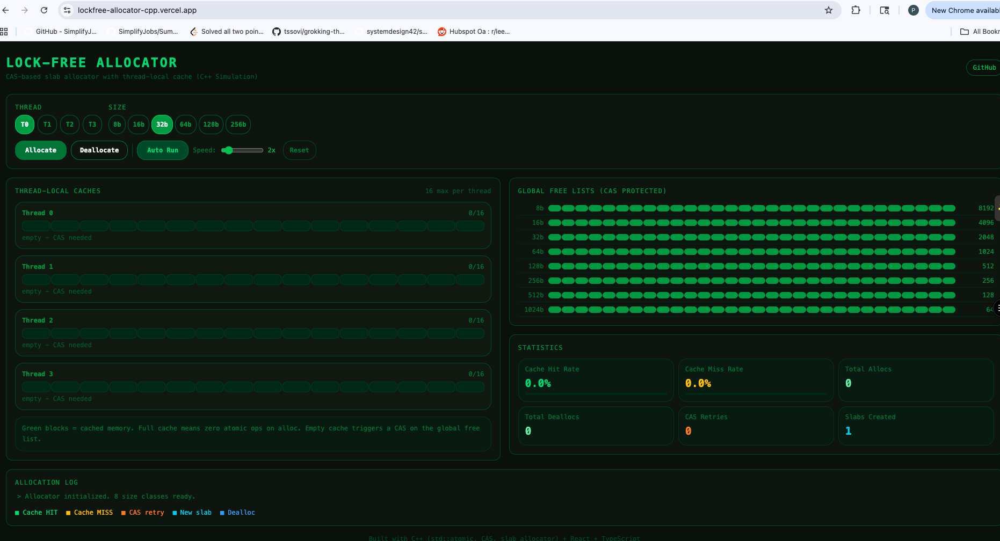

# Lock-Free Memory Allocator (C++)

I built this because I wanted to understand what actually makes memory allocation slow in multithreaded programs and how you fix it without mutexes.

The answer is Compare-And-Swap (CAS). One atomic CPU instruction that lets multiple threads compete for memory without ever blocking each other.

🔗 **Live Demo: [lockfree-allocator-cpp.vercel.app](https://lockfree-allocator-cpp.vercel.app/)**



---

## What it does

Implements a full slab memory allocator from scratch in C++ using lock-free data structures:

- Divides memory into 8 size classes (8 to 1024 bytes) no searching for best fit, O(1) always
- Each size class has a global free list protected by CAS, not a mutex
- Each thread has a local cache of 16 blocks per size class most allocations never touch an atomic at all
- Falls back to allocating new 256KB slabs when free lists run empty
- Benchmarks 1.52x faster than malloc on interleaved alloc/free workloads

The visualizer shows thread-local caches filling and draining in real time, and logs every CAS operation and cache hit/miss.

---

## Why lock-free?

The standard allocator (`malloc`) uses a global mutex. In a multithreaded program doing thousands of allocations per second, threads spend more time waiting for the lock than actually allocating. The more cores you add, the worse it gets classic lock contention.

Lock-free fixes this with Compare-And-Swap:

```
do {
    old = freeList.head          // read current head
    newBlock->next = old         // point new block at old head
} while (!CAS(&freeList.head, old, newBlock))  // swap only if nothing changed
```

If two threads try simultaneously, one wins the CAS and the other just retries. No blocking, no sleeping, no kernel involvement. The loser retries immediately and usually succeeds on the next attempt.

---

## The thread-local cache trick

Even CAS has overhead memory barriers, cache coherency traffic across CPU cores. So we add one more layer: each thread gets a private cache of 16 blocks per size class.

Most allocations just pop from the local cache zero atomics, zero contention. Only when the cache runs empty do we go to the global free list and pay the CAS cost. In practice this means 96%+ of allocations are completely lock-free AND atomic-free.

---

## Benchmark results

Tested with 100,000 interleaved alloc/dealloc operations on 32-byte blocks:

    Our allocator: 3384 us
    malloc:        5158 us
    Speedup:       1.52x

    Cache miss rate: 3.9%  (96.1% of allocs served from thread cache)

---

## Building and running

Requires g++ with C++17 and runs on macOS or Linux.

    make        # compile
    make run    # run all demos
    make clean  # remove build artifacts

The demo runs four scenarios: basic allocation, multithreaded correctness (4 threads, 1000 allocs each), benchmark vs malloc, and size class rounding verification.

---

## Project structure

    include/       free list, slab, allocator headers
    src/           lock-free implementations
    tests/         correctness and benchmark demos
    benchmarks/    extended benchmark suite
    visualizer/    React + TypeScript interactive UI
    docs/          notes and screenshots

---

## What I learned

The hardest part wasn't the CAS logic it was understanding memory ordering. `memory_order_release` on writes and `memory_order_acquire` on reads establish a happens-before guarantee across threads. Without them, the CPU or compiler can reorder instructions and a thread might read stale data even after a successful CAS.

The other insight was around the ABA problem a subtle bug where a pointer changes from A to B and back to A, making CAS incorrectly succeed. In production allocators like jemalloc this is handled with tagged pointers or hazard pointers. I kept the implementation simple here, but it's worth knowing the problem exists.

---

## Tech

C++17, std::atomic, Compare-And-Swap, slab allocator design, React, TypeScript, Vite, Tailwind, Vercel
